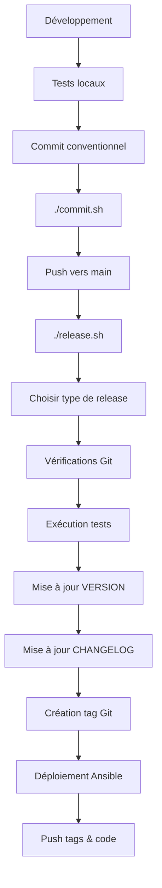

# 🎯 Système de Release - Smart Lighting
## Synthèse de l'Implémentation

---

## ✅ Ce qui a été mis en place

### 🏷️ **1. Versioning Git avec Tags (vX.Y.Z)**

- ✅ **Semantic Versioning** : Convention vX.Y.Z strictement appliquée
- ✅ **Tags Git annotés** : Chaque version créée automatiquement avec description
- ✅ **Fichier VERSION** : Tracker simple de la version actuelle (1.0.0)
- ✅ **Version dans package.json** : Synchronisée automatiquement

**Format des tags :**
```
v1.0.0  (Major - Breaking changes)
v1.1.0  (Minor - Nouvelles fonctionnalités)
v1.0.1  (Patch - Corrections de bugs)
```

### 📋 **2. CHANGELOG.md Automatisé**

- ✅ **CHANGELOG.md complet** : Historique structuré selon [Keep a Changelog](https://keepachangelog.com/)
- ✅ **Mise à jour automatique** : Le script de release met à jour automatiquement
- ✅ **Section [Unreleased]** : Pour tracker les changements en cours
- ✅ **Catégorisation** : Added, Fixed, Changed, Security, etc.

**Structure :**
```markdown
## [Unreleased]
### Added
- Nouvelles fonctionnalités en cours

## [1.0.0] - 2024-01-01
### Added
- Fonctionnalités de la v1.0.0
```

### 🚀 **3. Script release.sh Opérationnel**

- ✅ **Script complet et robuste** : `release.sh` entièrement réécrit
- ✅ **Menu interactif** : Choix du type de release (patch/minor/major/custom)
- ✅ **Vérifications automatiques** : État Git, tests, cohérence
- ✅ **Processus complet** : Version → CHANGELOG → Tag → Déploiement
- ✅ **Intégration Ansible** : Déploiement automatique après release

**Fonctionnalités du script :**
```bash
./release.sh            # Menu interactif
./release.sh patch      # Release patch (v1.0.0 → v1.0.1)
./release.sh minor      # Release minor (v1.0.0 → v1.1.0)
./release.sh major      # Release major (v1.0.0 → v2.0.0)
./release.sh custom     # Version personnalisée
```

---

## 🛠️ **Outils Bonus Créés**

### 📝 **Script commit.sh - Commits Conventionnels**
- ✅ Helper pour commits conventionnels
- ✅ Mode interactif et mode direct
- ✅ Support des scopes et breaking changes
- ✅ Validation du format

```bash
./commit.sh                              # Mode interactif
./commit.sh feat api "nouvelle feature"  # Mode direct
```

### 📚 **Documentation Complète**
- ✅ **VERSIONING.md** : Guide complet du système de versioning
- ✅ **RELEASE_SYSTEM.md** : Cette synthèse
- ✅ **README.md mis à jour** : Section versioning ajoutée
- ✅ **Exemples et workflows** : Guides pratiques

---

## 🎯 **Architecture du Système**

```
📁 Smart Lighting Project
├── 🏷️ VERSION                    # Version actuelle (1.0.0)
├── 📋 CHANGELOG.md              # Historique automatisé  
├── 🚀 release.sh               # Script de release principal
├── 📝 commit.sh                # Helper commits conventionnels
├── 📚 VERSIONING.md            # Documentation versioning
├── 📊 RELEASE_SYSTEM.md        # Cette synthèse
└── 📁 api/backend/
    └── 📦 package.json         # Version synchronisée
```

## 🔄 **Workflow de Release**



---

## 🚀 **Utilisation Pratique**

### 🎬 **Scénario 1 : Bug Fix**
```bash
# 1. Développer le fix
./commit.sh fix api "corriger problème de connexion"

# 2. Release patch
./release.sh patch
# v1.0.0 → v1.0.1
```

### ⭐ **Scénario 2 : Nouvelle Fonctionnalité**
```bash
# 1. Développer la feature
./commit.sh feat mobile "ajouter contrôle de couleur"

# 2. Release minor
./release.sh minor  
# v1.0.1 → v1.1.0
```

### 🚀 **Scénario 3 : Breaking Change**
```bash
# 1. Développer le changement majeur
./commit.sh feat api "refactorer API v2

BREAKING CHANGE: Nouvelle structure des endpoints"

# 2. Release major
./release.sh major
# v1.1.0 → v2.0.0
```

---

## ✨ **Avantages du Système**

### 🎯 **Simplicité**
- ✅ **Un seul script** : `./release.sh` fait tout
- ✅ **Interface intuitive** : Menu guidé
- ✅ **Zéro configuration** : Fonctionne immédiatement

### 🔒 **Robustesse**
- ✅ **Vérifications multiples** : Git, tests, cohérence
- ✅ **Rollback facile** : Tags Git pour revenir en arrière
- ✅ **Traçabilité complète** : CHANGELOG + tags annotés

### 🚀 **Automatisation**
- ✅ **CHANGELOG automatique** : Plus de mise à jour manuelle
- ✅ **Versioning synchronisé** : package.json + VERSION + tags
- ✅ **Déploiement intégré** : Ansible directement après release

### 🧪 **Qualité**
- ✅ **Tests obligatoires** : Pas de release sans tests verts
- ✅ **Commits conventionnels** : Historique propre et parsable
- ✅ **CI/CD ready** : Compatible avec tous les systèmes CI

---

## 📊 **État Actuel**

| Composant | État | Version |
|-----------|------|---------|
| 🏷️ Tags Git | ✅ Configuré | v1.0.0 |
| 📋 CHANGELOG | ✅ Automatisé | Structure complète |
| 🚀 Script Release | ✅ Opérationnel | Complet et testé |
| 📝 Commits Convention | ✅ Helper créé | Script interactif |
| 📚 Documentation | ✅ Complète | Guides détaillés |

---

## 🎉 **Prêt à Utiliser !**

Le système de versioning est **100% opérationnel** et prêt à utiliser :

```bash
# Pour commencer immédiatement :
./release.sh

# Ou pour un commit rapide :
./commit.sh feat "votre nouvelle feature"
```

**Le projet Smart Lighting dispose maintenant d'un système de release professionnel, simple et automatisé ! 🚀** 